# Gabriela Ramos

I am a Computer Engineering student and Front-end Developer dedicated to creating high-performance, responsive web interfaces using HTML5, CSS3, JavaScript, and MySQL.💻✅
  
What sets my profile apart is the intersection of web development and Cybersecurity. I conduct academic research on Post-Quantum Cryptography with C++ and have shared my findings as a speaker at technical events, translating complex security concepts for various audiences.🔐🎤
  
With Advanced English and a solid foundation in programming logic, I combine technical expertise with strong organizational and interpersonal skills—developed through years of experience in process management and customer service.💁🏼‍♀️
 

### Languages ​​and Technologies

          

     

     

     

     

          

          

          

          

          

 
 

### Statistics

